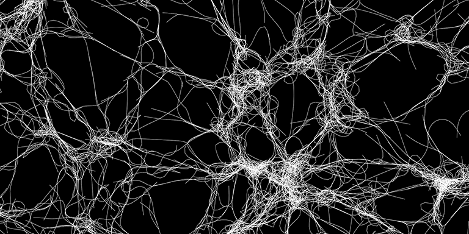

# Cytosim

Cytosim is an [open-source](LICENSE.txt) cytoskeleton simulation suite designed to model large systems of flexible filaments and their associated proteins, such as molecular motors. It has been extensively used to study actin and microtubule dynamics in 1D, 2D, and 3D.

Built around an optimized C++ core engine, Cytosim runs on UNIX, macOS, GNU/Linux, and within the Windows Subsystem for Linux (WSL). The modular and extensible design makes it highly adaptable, allowing customization for specific research needs. Additionally, a versatile set of Python programs streamlines the standard simulation workflow.

Cytosim has been used in approximately 100 research articles from [our](doc/publications/index.md) and [other research groups](doc/publications/biblio.md).

Cytosim offers command-line tools with simulation and display capabilities. Simulations are defined using a [configuration file](doc/sim/config.md) which specifies objects, their parameters, and a sequence of operations such as advancing time, saving frames, or [generating reports](doc/sim/report.md). Below is a basic example, where parameters are expressed in [seconds, micrometers and pico-Newtons](doc/sim/units.md).

	set simul system
	{
	    time_step = 0.005
	    viscosity = 0.02
	}
	
	set space cell
	{
	    shape = sphere
	}
	
	set fiber microtubule
	{
	    rigidity = 20
	    segmentation = 0.5
	    confine = inside, 200, cell
	}
	    
	new cell
	{
	    radius = 5
	}
	
	new 5 microtubule
	{
	    length = 11
	}
	
	run 5000 system
	{
	    nb_frames = 10
	}

# Installation

Cytosim uses the CPU and does not require any specific hardware. It is distributed as source code and [must be compiled](doc/compile/index.md) before use. 

* On Mac OS X: install [Xcode](https://developer.apple.com/xcode), free on the App Store.
* Linux: install [the GNU compiler](https://gcc.gnu.org) or another standard compiler. 
* Compiling natively on Windows would require changes to the code. For Windows 10 and later, please use the [Windows Subsystem for Linux](doc/compile/wsl.md), and for older Windows versions, [use Cygwin](doc/compile/cygwin.md).

## Required Libraries

* [BLAS](http://netlib.org/blas)
* [LAPACK](http://netlib.org/lapack)
* [Ncurses](https://invisible-island.net/ncurses)
- [pthreads](http://en.wikipedia.org/wiki/POSIX_Threads)
- [OpenGL](http://www.opengl.org) 
- [GLUT](http://www.opengl.org/resources/libraries/glut) or [freeGLUT](http://freeglut.sourceforge.net).

There are [different ways](doc/compile/index.md) to install these libraries.

## Instructions

To download the source code, enter these commands in a terminal window:

	git clone https://gitlab.com/f-nedelec/cytosim
	cd cytosim
	
To compile using [make](https://www.gnu.org/software/make), try:
	
	make

If this fails, parameters of `makefile.inc` need to be updated.
Altermatively, it is possible to use [cmake](https://cmake.org) to configure `make` automatically:

	mkdir build
	cd build
	cmake ..
	make

Compilation should take a few minutes and produce two executables: `sim` and `play`.  
For troubleshooting, please check [the compile instructions](doc/compile/index.md).

# Testing

A batch simulation is started from [the command line](https://en.wikipedia.org/wiki/Command-line_interface) preferably in a separate folder:

	mkdir run0
	cp cym/self.cym run0/config.cym
	cd run0
	../bin/sim
	
Within less than a minute, this should produce output files (`objects.cmo` and `properties.cmp`) in the subdirectory. These binary files can be read by `play` to produce a graphical display:

	../bin/play

Alternatively, a live graphical simulation can be started from [the command line](https://en.wikipedia.org/wiki/Command-line_interface) by specifying the path of a configuration file, for example:

	bin/play cym/self.cym

This will produce the display directly, without writing any file.
Once *cytosim* is running on your machine, proceed with the [tutorials](doc/tutorials/index.md), the page on [running simulations](doc/main/runs.md), and the examples contained in the folder `cym`. 

# Documentation

[Link to documentation](doc/index.md)

The Brownian dynamics approach was described in:  
[Collective Langevin Dynamics of Flexible Cytoskeletal Fibers](http://iopscience.iop.org/article/10.1088/1367-2630/9/11/427/meta)

A recent protocol demonstrating the use of Cytosim is:
[A Typical Workflow to Simulate Cytoskeletal Systems](https://dx.doi.org/10.3791/64125)

The documentation source files use [Markdown](https://en.wikipedia.org/wiki/Markdown) and are best viewed with [MacDown (Mac OSX only)](https://macdown.uranusjr.com) or [Typora (Cross platform)](https://typora.io) 

# Contributors

 The project was started in 1995, and received its name in 1999.
 We hope cytosim can be useful for your research. 
 Sincerely yours, The Developers of Cytosim:

*  Francois J. Nedelec     1995-
*  Dietrich Foethke        2003-2007
*  Cleopatra Kozlowski     2003-2007
*  Elizabeth Loughlin      2006-2010
*  Ludovic Brun            2008-2010
*  Beat Rupp               2008-2011
*  Jonathan Ward           2008-2014
*  Antonio Politi          2010-2012
*  Andre-Claude Clapson    2011-2013
*  Jamie-Li Rickman        2014-2019
*  Gaelle Letort           2014-2022
*  Maud Formanek           2020-2023
*  Manuel Lera-Ramirez     2017-2024
*  Serge Dmitrieff         2013-
*  Julio Belmonte          2014-

# History

Older versions of the project:

* [Cytosim-2017](https://github.com/nedelec/cytosim-2017)
* [Cytosim-2023](https://gitlab.com/f-nedelec/cytosim-2023)

# Contact

F.J. Nedelec

