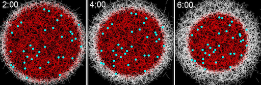
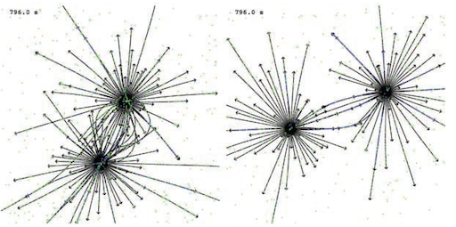
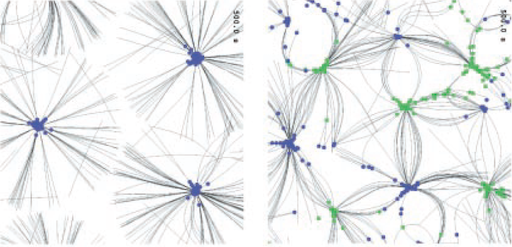

# Projects done with Cytosim

This is a list of some selected work from the Nedelec group using Cytosim.  
[Additional references from other research groups](biblio.md)

[Detailed protocol to use Cytosim](https://arxiv.org/abs/2205.13852)  

[Spindle assembly in plants](https://www.biorxiv.org/content/10.1101/2023.11.14.567058v1)  

[aster formation in Xenopus laevis egg extract ](https://www.molbiolcell.org/doi/10.1091/mbc.E23-10-0407)  

[Microtubule overlaps produced by diffusible crosslinkers](https://doi.org/10.1016/j.cub.2019.05.049)  

[Microtubule organization by mitotic motors](https://doi.org/10.1016/j.cell.2018.09.029)  

[Optimization of gliding assays](http://pubs.rsc.org/en/Content/ArticleLanding/2012/LC/c2lc40250e#!divAbstract)  

[Mitotic spindle scaling](https://doi.org/10.1016/j.cell.2011.11.014)  

[Mitotic spindle organization](https://doi.org/10.1083/jcb.201006076)  

[Dynamic organization of actin](http://www.sciencedirect.com/science/article/pii/S0960982216000543)   

[Contraction of filamentous networks](http://msb.embopress.org/content/13/9/941)  

[Networks with motor minifilaments](http://jcs.biologists.org/content/132/4/jcs219717)  

[Centrosome centering](http://www.molbiolcell.org/content/27/18/2833.short)  

[Formation of microtubules arrays in yeast](https://doi.org/10.1016/j.cell.2006.12.030)  

[Nucleus positionning in yeast](https://doi.org/10.1038/msb.2008.76)  

[Nuclear movements in multinucleated fungi](http://www.molbiolcell.org/content/28/5/645.abstract)  

[Nuclear movements during development in C.elegans](http://www.cell.com/cell-reports/abstract/S2211-1247(16)30093-6)  

[Endocytosis in yeast](https://doi.org/10.1016/j.cell.2018.06.032)  

[Regulation of spindle length in C.elegans](https://doi.org/10.1016/j.devcel.2018.04.022)  

[Effects of spatial dimensionality and steric interactions on microtubule-motor self-organization.](https://doi.org/10.1088/1478-3975/ab0fb1)  

[Mitotic spindle design principles](https://doi.org/10.7554/eLife.03398)  

[Formation of the microtubule marginal band in blood platelets](http://dx.doi.org/10.1073/pnas.1618041114)  

[Mitotic spindle positionning](https://doi.org/10.1016/j.cell.2007.03.027)  

[Chromosome capture](https://rupress.org/jcb/article/217/8/2661/39451/F-Actin-nucleated-on-chromosomes-coordinates-their)  

[disassembly-driven contraction of F-actin network](https://doi.org/10.1016/j.cub.2014.05.019)  

[Nucleus breakdown in starfish oocytes](https://doi.org/10.1016/j.cub.2014.05.019)  

[Nucleus positionning in myotubes](https://doi.org/10.1016/j.cub.2017.08.031)  

[Movements of melanosomes](https://doi.org/10.1038/s41467-020-17212-6)  

[Karyogamy](http://www.genesdev.org/cgi/doi/10.1101/gad.206318.112)  

[Spindle pole focussing](https://doi.org/10.1083/jcb.200505107)  

[Self organization in confined space](http://www.cell.com/current-biology/abstract/S0960-9822(09)01025-2)  

[Interactions of microtubule asters](https://doi.org/10.1083/jcb.200202051)  

[Properties determining Self organization of Microtubules and Motors](https://doi.org/10.1126/science.1059758)  

[Motor concentration](https://journals.aps.org/prl/abstract/10.1103/PhysRevLett.86.3192)  

[Self organization of Microtubules and Motors](https://www.nature.com/articles/38532)  

